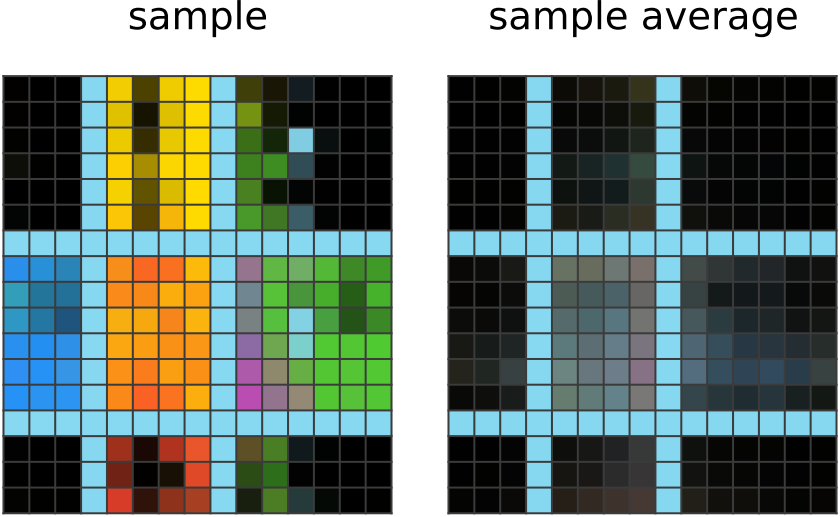

<br/><br/>
<a name="topofpage"></a>

<br/><br/>

This project's aim is to revitalize the niche perspective in machine learning that **lossless information compression is sufficient to produce intelligent behavior**. Although researchers have long speculated that efficient compression is at the heart of intelligence (see, e.g., [Hernández-Orallo & Minaya-Collado, 1998](https://www.researchgate.net/publication/2472570_A_Formal_Definition_of_Intelligence_Based_on_an_Intensional_Variant_of_Algorithmic_Complexity); [Mahoney, 1999](https://gwern.net/doc/cs/algorithm/information/compression/1999-mahoney.pdf); [Hutter, 2005](https://link.springer.com/book/10.1007/b138233); [Legg & Hutter, 2007](https://arxiv.org/abs/0712.3329)), this idea flew under the radar because it has struggled to directly yield scalable algorithms. We tried leveraging information compression to solve the data-limited [ARC-AGI challenge](https://arcprize.org/), and developed a method that achieves 20% on the evaluation set, with the following properties:

- **No pretraining**; models are randomly initialized and trained during test time.
- **No dataset**; one model trains on just the target ARC-AGI puzzle and outputs one answer.
- **No search**, in most senses of the word—just gradient descent.
- 34.75% on training set (19.45 min per puzzle, 1x RTX 4070).
- 20% on evaluation set (20.64 min per puzzle, 1x RTX 4070).

To our knowledge, **this is the first neural method for solving ARC-AGI where the training data is limited to just the target puzzle.**

While [o3](https://arcprize.org/blog/oai-o3-pub-breakthrough) achieves 87.5% on the semi-private evaluation set using an entire internet's worth of training data, our focus is on the data-limited regime—precisely where compression excels. ARC-AGI is extremely data-limited, often forcing researchers to build sophisticated collections of data augmentations and synthetic puzzles. Even without external pretraining, extensive data gathering, or large-scale search, lossless information compression (via neural networks) applied directly to each ARC puzzle is sufficient to grok the answer from just the information in the target puzzle.

<br/><br/>
---

# Table of Contents

[Top of Page](#topofpage)
1. [Table of Contents](#table-of-contents)
2. [What is ARC-AGI?](#what-is-arc-agi)
3. [Our Solution Method](#our-solution-method)
    - [Watching the Network Learn: Color the Boxes](#watching-the-network-learn-color-the-boxes)
4. [How to Derive Our Solution Method](#how-to-derive-our-solution-method)
    - [A Primer on Lossless Information Compression](#a-primer-on-lossless-information-compression)
    - [One-Size-Fits-All Compression](#one-size-fits-all-compression)
    - [Neural Networks to the Rescue](#neural-networks-to-the-rescue)
5. [Architecture](#architecture)
    - [Multitensors](#multitensors)
6. [Results](#results)
    - [What Puzzles Can and Can't We Solve?](#what-puzzles-can-and-cant-we-solve)
7. [Case Study: Color the Boxes](#case-study-color-the-boxes)
    - [Solution Analysis: Color the Boxes](#solution-analysis-color-the-boxes)
8. [How to Improve Our Work](#how-to-improve-our-work)
    - [Joint Compression via Weight Sharing Between Puzzles](#joint-compression-via-weight-sharing-between-puzzles)
    - [Convolution-like Layers for Shape Copying Tasks](#convolution-like-layers-for-shape-copying-tasks)
    - [KL Floor for Posterior Collapse](#kl-floor-for-posterior-collapse)
    - [Regularization](#regularization)
9. [Related Work](#related-work)
    - [Equivalence of Compression and Intelligence](#equivalence-of-compression-and-intelligence)
    - [Information Theory and Coding Theory](#information-theory-and-coding-theory)
    - [Variational Autoencoders](#variational-autoencoders)
    - [ARC-AGI Methods](#arc-agi-methods)
    - [Deep Learning Achitectures](#deep-learning-architectures)
10. [Appendix](#appendix)
    - [Layers in the Architecture](#layers-in-the-architecture)
        - [Decoding Layer](#decoding-layer)
        - [Multitensor Communication Layer](#multitensor-communication-layer)
        - [Softmax Layer](#softmax-layer)
        - [Directional Cummax/Shift Layer](#directional-cummaxshift-layer)
        - [Directional Communication Layer](#directional-communication-layer)
        - [Nonlinear Layer](#nonlinear-layer)
        - [Normalization Layer](#normalization-layer)
        - [Linear Heads](#linear-heads)
    - [Other Architectural Details](#other-architectural-details)
        - [Rules for legal multitensors](#rules-for-legal-multitensors)
        - [Weight Tying for Reflection/Rotation Symmetry](#weight-tying-for-reflectionrotation-symmetry)
        - [Training](#training)
    - [Preprocessing](#preprocessing)
    	- [Output Shape Determination](#output-shape-determination)
    	- [Number of Colors](#number-of-colors)
    - [Postprocessing](#postprocessing)
    - [What Happens to the Representations during Learning](#what-happens-to-the-representations-during-learning)
    - [Additional Case Studies](#additional-case-studies)
    	- [Case Study: Bounding Box](#case-study-bounding-box)
    	    - [Watching the Network Learn: Bounding Box](#watching-the-network-learn-bounding-box)
    	    - [Solution Analysis: Bounding Box](#solution-analysis-bounding-box)
    	- [Case Study: Center Cross](#case-study-center-cross)
    	    - [Solution Analysis: Center Cross](#solution-analysis-center-cross)
    - [List of Mentioned ARC-AGI Puzzles](#list-of-mentioned-arc-agi-puzzles)
    - [Code](#code)


<br/><br/>
---

# What is ARC-AGI?

[ARC-AGI](https://arcprize.org/) is an artifical intelligence benchmark [introduced in 2019](https://arxiv.org/abs/1911.01547) that motivates researchers to work on problems and methods that are key to the future development of [artificial general intelligence](https://arxiv.org/abs/1911.01547) (AGI). Many see it as a test that indicates AGI if solved, though this is not its original intention. It is a dataset consisting IQ-test-like puzzles. Below are three of the 1000 puzzles:

| Hidden rule: Shift every object to the right by one pixel, except the bottom/right edges of the object. | Hidden rule: Shrink the big object and set its color to the scattered dots' color. | Hidden rule: Extend the green line to meet the red line by turning when hitting a wall. |
| -------- | ------------------------- | -------- |
|  |  |  |

For every puzzle, there is a hidden rule that maps each input grid to each output grid. You are given some number of examples of input-to-output mappings, and you get **two attempts** to guess the output grid for a given input grid, without being told the hidden rule. If either guess is correct, then you score 1 for that puzzle, else you score 0. You are allowed to change the size of the output grid and pick the color of every pixel. The puzzles are designed so that **humans can reasonably find the answer, but machines should have more difficulty**. [The average human can solve 76.2% of the training set](https://arcprize.org/guide), and [a human expert can solve 98.5%.](https://arxiv.org/abs/2409.01374)

There are 400 public training puzzles, 400 public evaluation puzzles, 100 semi-private evaluation puzzles, and 100 test puzzles not released to the public. The training puzzles are easier than the rest of the puzzles, and are meant to help you absorb the following assumed knowledge which is useful for solving the other splits:
- **Objectness:** Objects persist and cannot appear or disappear without reason. Objects can interact or not depending on the circumstances.
- **Goal-directedness:** Objects can be animate or inanimate. Some objects are "agents" - they have intentions and they pursue goals.
- **Numbers & counting:** Objects can be counted or sorted by their shape, appearance, or movement using basic mathematics like addition, subtraction, and comparison.
- **Basic geometry & topology:** Objects can be shapes like rectangles, triangles, and circles which can be mirrored, rotated, translated, deformed, combined, repeated, etc. Differences in distances can be detected.

The ARC Prize team has repeatedly launched competitions for solving ARC-AGI, with monetary rewards. [The most recent competition](https://www.kaggle.com/competitions/arc-prize-2024) involved potential prizes and awards of upwards of **$1,000,000**, with the main prize reserved for methods which could achieve 85% on the private test set, using 12 hours of compute in a constrained environment.

<br/><br/>
---

# Our Solution Method


**We believe lossless information compression schemes can be used as programs for solving ARC-AGI. The more bit-efficient the compression scheme, the "smarter" the answer and the more correct it is, and with enough bit efficiency we can eventually get the right answer.** To solve a set of ARC-AGI puzzles, we find the smallest possible bit string that when decompressed, exactly produces the set of target puzzles, but with any answers filled in. Those are our answer guesses. The main challenge is to find a bit-efficient encoder-decoder system where the encoder doesn't need any answers as input to make the bit string. Our method for solving ARC-AGI uses a **training algorithm** and a **neural network forward pass** as the **encoder** and **decoder**, respectively, and the compressed bit representation contains learned parameters such as the weights and inputs for the network.

In standard machine learning lingo: (without compression terminology, and with some simplifications)

1. We start at inference time, and we are given an ARC-AGI puzzle to solve. (Eg. Puzzle in the diagram below.)
2. We construct a neural network $f$ (see [architecture](#architecture)) designed for the puzzle's specifics (eg. number of examples, observed colors). The network takes random normal input $z \sim N(\mu, \Sigma)$, and per-pixel color logit predictions across all the grids, including an answer grid (3 input-output examples, for a total of 6 grids). Importantly, $f_\theta$ is equivariant to common augmentations—such as reordering input-output pairs (including the answer's pair), color permutations, and spatial rotations/reflections.
3. We initialize the network weights $\theta$ and set the parameters $\mu$ and $\Sigma$ for the $z$ distribution.
4. We jointly optimize $\theta$, $\mu$, and $\Sigma$ to minimize the sum of cross-entropies over the known grids (5 of them,) ignoring the answer grid. A KL divergence penalty keeps $N(\mu, \Sigma)$ close to $N(0,1)$, as in a VAE.
5. Since the generated answer grid is stochastic due to the randomness in $z$, we save the answer grids throughout training and choose the most frequently occuring one as our final prediction.


It isn't obvious why such a method is performing compression. You'll see later [how we derived it](#how-to-derive-our-solution-method) from trying to compress ARC-AGI. First, let's see it try to solve the puzzle above.

### Watching the Network Learn: Color the Boxes

#### Human Solution:
We first realize that the input is divided into boxes, and the boxes are still there in the output, but now they're colored. We then try to figure out which colors go in which boxes. First, we notice that the corners are always black. Then, we notice that the middle is always magenta. And after that, we notice that the color of the side boxes depends on which direction they are in: red for up, blue for down, green for right, and yellow for left. At this point, we copy the input over to the answer grid, then we color the middle box magenta, and then color the rest of the boxes according to their direction.

#### Network Solution:
<table width="100%" style="border: none;">
  <tr>
  <td width="50%">
  <strong> 50 steps of learning:</strong>
  <br><br/>
  The network, given random input $z$, outputted an answer grid (sample) with light blue rows/columns wherever the input has the same. The network noticed that all the other input-output pairs in the puzzle exhibit this correspondence. The network doesn't know how the other output pixels are assigned colors; an exponential moving average of the network output (sample average) shows the network assigning mostly the same average color to non-light-blue pixels.
  </td>
  <td width="50%"></td>
  </tr>
  <tr>
  <td width="50%">
  <strong> 150 steps of learning:</strong>
  <br><br/>
  The network outputs a grid where nearby pixels have similar colors. The network has likely noticed that this is common among all the outputs, and is guessing that it applies to the answer too.
  </td>
  <td width="50%"></td>
  </tr>
  <tr>
  <td width="50%">
  <strong> 200 steps of learning:</strong>
  <br><br/>
  The network output now shows larger blobs of colors that are cut off by the light blue borders. The network has noticed the common usage of borders to demarcate blobs of colors in other outputs, and applies the same idea here. The network has also noticed black corner blobs in other given outputs, which the network imitates.
  </td>
  <td width="50%"></td>
  </tr>
  <tr>
  <td width="50%">
  <strong> 350 steps of learning:</strong>
  <br><br/>
  The network output now shows the correct colors assigned to boxes of the correct direction from the center. The network has realized that a single color-to-direction mapping is used to pick the blob colors in the other given outputs, so it imitates this mapping. It is still not the best at coloring within the lines, and it's also confused about the center blob, probably because the middle does not correspond to a direction. Nevertheless, the averate network output does show a tinge of the correct magenta color in the middle, meaning the network is catching on. The most common answer guess from the network does actually have magenta in the middle.
  </td>
  <td width="50%"></td>
  </tr>
  <tr>
  <td width="50%">
  <strong> 1500 steps of learning:</strong>
  <br><br/>
  The network is as refined as it will ever be. Sometimes it will still make a mistake in the sample it outputs, but this uncommon and filtered out.
  </td>
  <td width="50%"></td>
  </tr>
</table>

After training, [we can deconstruct the learned z distribution](#solution-analysis-color-the-boxes) to find that it codes for a color-direction correspondence table and row/column divider positions!

<br/><br/>
---

# How to Derive Our Solution Method

Again, it isn't obvious how we get from trying to perform compression to the method we ended up using. The derivation of our algorithm takes us on a detour through [information theory](https://en.wikipedia.org/wiki/Information_theory), [algorithmic information theory](https://arxiv.org/abs/0809.2754), and [coding theory](https://en.wikipedia.org/wiki/Coding_theory), with machine learning only making an appearance near the end.

### A Primer on Lossless Information Compression

In [information theory](https://en.wikipedia.org/wiki/Information_theory), lossless information compression is about trying to represent some information in as few bits as possible, while still being able to reconstruct that information from the bit representation. This type of problem is abstracted as follows:
- A source produces some symbol $x$ from some process that generates symbols from a probability distribution $p(x)$.
- A compressor/encoder $E$ must map the symbol $x$ to a string of bits $s$.
- A decompressor/decoder $D$ must exactly map $s$ back to the original symbol $x$.

The goal is to use $p$ to construct functions $(E, D)$ which are bit-efficient, (ie. that minimize the expected length of $s$,) without getting any symbols wrong. In our case, the symbol $x$ is the ARC-AGI dataset (many puzzle + answer pairs), and we want to figure out what answers the best compression system might decompress the answers to be. Except, we don't have the answers (only the puzzles) to give as input to $E$, and we don't know $p$, since it's hard to model the intelligent process of puzzle ideation in humans.

### One-Size-Fits-All Compression

To build our compression scheme, you might think we need to know what $p$ is, but we argue that it doesn't really matter since we can make a one-size-fits-all compressor. It all hinges on the following assumption:
> There exists some practically implementable, bit efficient compression system $(E, D)$ for ARC-AGI datasets $x$ sampled from $p$.

If this were false, our whole idea of solving ARC-AGI with compression is doomed even if we knew $p$ anyways, so we might as well make this assumption.

Our one-size-fits-all compressor $(E', D')$ is built without knowing $p$, and it is almost just as bit-efficient as the original $(E, D)$:
- $E'$ observes symbol $x$, picks a program $f$ and input $s$ to minimize $\text{len}(f)+\text{len}(s)$ under the constraint that running the program makes $f(s)=x$, and then sends the pair $(f, s)$.
- $D'$ is just a program executor that executes $f$ on $s$, correctly producing $x$.

It is possible to prove with [algorithmic information theory](https://arxiv.org/abs/0809.2754) that $(E', D')$ achieves a bit efficiency at most $\text{len}(f)$ bits worse than the bit efficiency of $(E, D)$, where $f$ is the _code for implementing D_. But since compression is practically implementable, the code for $D$ should be simple enough for a human engineer to write, so $\text{len}(f)$ must be short, meaning our one-size-fits-all compressor will be close to the best possible bit efficiency.

Ironically, the only problem with using this to solve ARC-AGI is that implementing $E'$ is not practical, since $E'$ needs to minimize the length of a program-input pair $(f, s)$ under partial fixed output constraint $f(s)\_{answers}=x\_{answers}$.

### Neural Networks to the Rescue

To avoid searching through program space, we just pick a program $f$ for a small sacrifice in bit efficiency. We hope the diversity of program space can be delegated to diversity in input $s$ space instead. Specifically, we write a program $f$ that runs the forward pass of a neural network, where $s=(\theta, z, \epsilon)$ are the weights, inputs, and corrections to the outputs of the neural network. Then, we can use gradient descent to "search" over $s$.

This restricted compression scheme uses [Relative Entropy Coding](https://arxiv.org/abs/2010.01185) (REC)[^3] to encode noisy weights $\theta$ and neural network inputs $z$ into bits $s_\theta$ and $s_z$, and [arithmetic coding](https://en.wikipedia.org/wiki/Arithmetic_coding) to encode output error corrections $\epsilon$ into bits $s_\epsilon$, to make a bit string $s$ consisting of three blocks $(s_\theta, s_z, s_\epsilon)$. The compression scheme runs as follows:
- The decoder runs $\theta = \text{REC-decode}(s_\theta)$, $z = \text{REC-decode}(s_z)$, $\text{logits} = \text{Neural-Net}(\theta, z)$, and $x=\text{Arithmetic-decode}(s_\epsilon, \text{logits})$.
- The encoder trains $\theta$ and $z$ to minimize the total code length $\mathbb{E}[\text{len}(s)]$. $s_\epsilon$ is fixed by arithmetic coding to guarantee correct decoding. To calculate the three components of the loss $\mathbb{E}[\text{len}(s)]$ in a differentiable way, we refer to the properties of REC and arithmetic coding:
	- It turns out that the $\epsilon$ code length $\mathbb{E}[\text{len}(s_\epsilon)]$ is equal to the total crossentropy error on all the given grids in the puzzle.
	- REC requires us to fix some reference distribution $q_\theta$, and also add noise to $\theta$, turning it into a distribution $p_\theta$. Then, REC allows you to store noisy $\theta$ using a code length of $\mathbb{E}[\text{len}(s_\theta)] = KL(p_\theta\|\| q_\theta) = \mathbb{E}\_{\theta \sim p_\theta} [\log (p_\theta(\theta) / q_\theta(\theta))]$ bits. We will choose to fix $q_\theta = N(0, I/2\lambda)$ for large $\lambda$, such that the loss component $\mathbb{E}[\text{len}(s_\theta)] \approx \lambda \| \theta\|^2 + \text{const}$ is equivalent to regularizing the decoder.
	- We must also do for $z$ what we do for $\theta$, since it's also represented using REC. We will choose to fix $q_z = N(0,I)$, so the code length of $z$ is $\mathbb{E}[\text{len}(s_z)] = KL(p_z\|\| q_z) = \mathbb{E}\_{z \sim p_z} [\log (p_z(z) / q_z(z))]$.

   We can compute gradients of these code lengths via the [reparameterization trick](https://arxiv.org/abs/1312.6114).

At this point, we observe that the total code length for $s$ that we described is actually the VAE loss with decoder regularization (= KL for $z$ + reconstruction error + regularization). Likewise, if we port the rest of what we described above (plus modifications regarding equivariances and inter-puzzle independence, and ignoring regularization) into typical machine learning lingo, we get the [above description of our method](#our-solution-method).


[^3]: A lot of caveats/issues are introduced by using REC. The code length when using REC only behaves in some limits and expectations, there may be a small added constant to the code length, the decoding may be approximate, etc. We're not up to date with the current literature, and we're ignoring all the sticky problems that may arise and presuming that they are all solved. We will never end up running Relative Entropy Coding anyways, so it doesn't matter that it takes runtime exponential in the code length. We only need to make use of the the fact that such algorithms exist, not that they run fast, nor that we can implement them, in order to derive our method.

<br/><br/>
---

# Architecture

We designed our own neural network architecture for decoding the latents $z$ into ARC-AGI puzzles. The most important feature of our architecture is it's equivariances, which are symmetry rules dictating that whenever the input $z$ undergoes a transformation, the output ARC-AGI puzzle must also transform the same way. Some examples:

- reordering of input/output pairs
- shuffling colors
- flips, rotations, and reflections of grids

There are too many equivariances for us to think about at once, so we decided to make a **base architecture that's fully symmetric**, and break unwanted symmetries one by one by **adding asymmetric layers** to give it [specific non-equivariant abilities](#what-puzzles-can-and-cant-we-solve).


To illustrate what we mean, suppose that both $z$ and an ARC-AGI puzzle take the form of a tensor of shape $[n\\_examples, n\\_colors, height, width, 2 \text{ for input/output}]$ (This is not actually the format of the data (see [multitensors](#multitensors)) but it gets the idea across best.) Then, our network starts out as equivariant to permutations of indices in the $example$, $color$, $height$, and $width$ dimensions. Some extra care must be taken with weight sharing, to force the network to also be equivariant to swapping the $width$ and $height$ dimensions. We may then add a layer involving a roll by one in the $width$ and $height$ dimensions, to let the network distinguish short range spatial interactions but not long-range ones.

<!-- When $z$ is fully symmetrical, then the outputted puzzle must also be fully symmetrical. But notice that [our method](#our-solution-method) is allowed to learn asymmetrical $z$ in order to obtain asymmetrical outputs. Since the $z$ distribution is penalized for deviating from the fully symmetric $N(0,I)$, asymmetrical outputs are discouraged. So, the network must pay a penalty to use $z$ to distinguish the learned roles of two colors, two rows, two pixels, etc. in a puzzle. This makes $z$ naturally lean towards simpler representations of the puzzle. -->

The actual data ($z$, hidden activations, and puzzles) passing through our layers comes in a format that we call a "**multitensor**", which is just a bucket of tensors of various shapes. All the equivariances can be described in terms of how they change a multitensor. **In order to understand any of the layers we list, you must first read the below section on multitensors.**


### Multitensors

Most common classes of machine learning architectures operate on a single type of tensor with constant rank. LLMs operate on rank 3 tensors of shape $[n\\_batch, n\\_tokens, n\\_channels]$, and CNNs operate on a rank 4 tensors of shape $[n\\_batch, n\\_channels, height, width]$. Our multitensors are a set of varying-rank tensors of unique type, whose dimensions are a subset of a rank 6 tensor of shape $[n\\_examples$, $n\\_colors$, $n\\_directions$, $height$, $width$, $n\\_channels]$. We always keep the channel dimension, so there are at most 32 tensors in every multitensor. We also maintain [several rules](#rules-for-legal-multitensors) that determine whether a tensor shape is "legal" or not, which reduces the number of tensors in a multitensor to 18.

| Dimension | Size                                                                                                                             |
| --------- | -------------------------------------------------------------------------------------------------------------------------------- |
| Example   | Number of examples in the ARC-AGI puzzle, including the one with held-out answer                                                 |
| Color     | Number of unique colors in the ARC-AGI puzzle, [not including black](#number-of-colors)                                          |
| Direction | 8                                                                                                                                |
| Height    | [Determined when preprocessing the puzzle](#output-shape-determination)                                                                       |
| Width     | [Determined when preprocessing the puzzle](#output-shape-determination)                                                                       |
| Channel   | In the residual connections, the size is 8 if the direction dimension is included, else 16. Within layers it is layer-dependent. |

To give an idea of how a multitensor stores data, an ARC-AGI puzzle can be represented by using the $[examples, colors, height, width, channel]$ tensor, by using the channel dimension to select either the input or output grid, and the width/height dimensions for pixel location, a one hot vector in the color dimension, specifying what color that pixel is. The $[examples, width, channel]$ and $[examples, height, channel]$ tensors can similarly be used to store masks representing grid shapes for every example for every input/output grid. All those tensors are included in a single multitensor that is computed by the network just before the final [linear heads](#linear-heads) layer.

When we apply an operation on a multitensor, we by default assume that all non-channel dimensions are treated identically as batch dimensions by default. The operation is copied across the indices of dimensions unless specified. This ensures that we keep all our symmetries intact until we use a specific layer meant to break a specific symmetry.

<!-- Some layers require an object for every tensor in a multitensor, so when talking about sets of objects all corresponding to the same multitensor, we may use the prefix "multi". For example, we may say "multiweights" when talking about using a linear layer with separate weights for every tensor in a multitensor.

Usually when talking about a tensor's shape, we will not mention the channel dimension as it is included by default. -->

**The full architecture consists of the following layers, which are each described in the Appendix:**
- Begin with parameters of the $z$ distribution,
- [Decoding Layer](#decoding-layer)
- 4x
	- [Multitensor Communication Layer, Upwards](#multitensor-communication-layer)
	- [Softmax Layer](#softmax-layer)
	- [Directional Cummax Layer](#directional-cummaxshift-layer)
	- [Directional Shift Layer](#directional-cummaxshift-layer)
	- [Directional Communication Layer](#directional-communication-layer)
	- [Nonlinear Layer](#nonlinear-layer)
	- [Multitensor Communication Layer, Downwards](#multitensor-communication-layer)
	- [Normalization Layer](#normalization-layer)
- [Linear Heads](#linear-heads)

<br/><br/>
---

# Results

### Training set: 34.75%

<p align="center">
  
</p>

<div align="center">
  <table>
    <tr>
      <th>Training Iteration</th>
      <th>Time</th>
      <th>Pass@1</th>
      <th>Pass@2</th>
      <th>Pass@5</th>
      <th>Pass@10</th>
      <th>Pass@100</th>
      <th>Pass@1000</th>
    </tr>
    <tr>
      <td>100</td>
      <td>6.48 h</td>
      <td>1%</td>
      <td>2.25%</td>
      <td>3.5%</td>
      <td>4.75%</td>
      <td>6.75%</td>
      <td>6.75%</td>
    </tr>
    <tr>
      <td>200</td>
      <td>12.97 h</td>
      <td>11.5%</td>
      <td>14.25%</td>
      <td>16.5%</td>
      <td>18.25%</td>
      <td>23.25%</td>
      <td>23.5%</td>
    </tr>
    <tr>
      <td>300</td>
      <td>19.45 h</td>
      <td>18.5%</td>
      <td>21.25%</td>
      <td>23.5%</td>
      <td>26.75%</td>
      <td>31.5%</td>
      <td>32.5%</td>
    </tr>
    <tr>
      <td>400</td>
      <td>25.93 h</td>
      <td>21%</td>
      <td>25%</td>
      <td>28.75%</td>
      <td>31%</td>
      <td>36%</td>
      <td>37.5%</td>
    </tr>
    <tr>
      <td>500</td>
      <td>32.42 h</td>
      <td>23%</td>
      <td>27.5%</td>
      <td>31.5%</td>
      <td>33.5%</td>
      <td>39.25%</td>
      <td>40.75%</td>
    </tr>
    <tr>
      <td>750</td>
      <td>48.62 h</td>
      <td>28%</td>
      <td>30.5%</td>
      <td>34%</td>
      <td>36.25%</td>
      <td>42.75%</td>
      <td>44.5%</td>
    </tr>
    <tr>
      <td>1000</td>
      <td>64.83 h</td>
      <td>28%</td>
      <td>31.75%</td>
      <td>35.5%</td>
      <td>37.75%</td>
      <td>43.75%</td>
      <td>46.5%</td>
    </tr>
    <tr>
      <td>1250</td>
      <td>81.04 h</td>
      <td>29%</td>
      <td>32.25%</td>
      <td>37%</td>
      <td>39.25%</td>
      <td>45.5%</td>
      <td>49.25%</td>
    </tr>
    <tr>
      <td>1500</td>
      <td>97.25 h</td>
      <td>29.5%</td>
      <td>33%</td>
      <td>38.25%</td>
      <td>40.75%</td>
      <td>46.75%</td>
      <td>51.75%</td>
    </tr>
    <tr>
      <td>2000</td>
      <td>129.66 h</td>
      <td>30.25%</td>
      <td>34.75%</td>
      <td>38.25%</td>
      <td>41.5%</td>
      <td>48.5%</td>
      <td>52.75%</td>
    </tr>
  </table>
</div>


### Evaluation set: 20%

<p align="center">
  
</p>

<div align="center">
  <table>
    <tr>
      <th>Training Iteration</th>
      <th>Time</th>
      <th>Pass@1</th>
      <th>Pass@2</th>
      <th>Pass@5</th>
      <th>Pass@10</th>
      <th>Pass@100</th>
      <th>Pass@1000</th>
    </tr>
    <tr>
      <td>100</td>
      <td>6.88 h</td>
      <td>0.75%</td>
      <td>1.25%</td>
      <td>2.25%</td>
      <td>2.5%</td>
      <td>3%</td>
      <td>3%</td>
    </tr>
    <tr>
      <td>200</td>
      <td>13.76 h</td>
      <td>5%</td>
      <td>6%</td>
      <td>7%</td>
      <td>7.75%</td>
      <td>12%</td>
      <td>12.25%</td>
    </tr>
    <tr>
      <td>300</td>
      <td>20.64 h</td>
      <td>10%</td>
      <td>10.75%</td>
      <td>12.25%</td>
      <td>13.25%</td>
      <td>15.5%</td>
      <td>16.25%</td>
    </tr>
    <tr>
      <td>400</td>
      <td>27.53 h</td>
      <td>11.75%</td>
      <td>13.75%</td>
      <td>16%</td>
      <td>17%</td>
      <td>19.75%</td>
      <td>20%</td>
    </tr>
    <tr>
      <td>500</td>
      <td>34.41 h</td>
      <td>13.5%</td>
      <td>15%</td>
      <td>17.75%</td>
      <td>19.25%</td>
      <td>20.5%</td>
      <td>21.5%</td>
    </tr>
    <tr>
      <td>750</td>
      <td>51.61 h</td>
      <td>15.5%</td>
      <td>17.75%</td>
      <td>19.75%</td>
      <td>21.5%</td>
      <td>22.75%</td>
      <td>25.5%</td>
    </tr>
    <tr>
      <td>1000</td>
      <td>68.82 h</td>
      <td>16.75%</td>
      <td>19.25%</td>
      <td>21.75%</td>
      <td>23%</td>
      <td>26%</td>
      <td>28.75%</td>
    </tr>
    <tr>
      <td>1250</td>
      <td>86.02 h</td>
      <td>17%</td>
      <td>20.75%</td>
      <td>23%</td>
      <td>24.5%</td>
      <td>28.25%</td>
      <td>30.75%</td>
    </tr>
    <tr>
      <td>1500</td>
      <td>103.22 h</td>
      <td>18.25%</td>
      <td>21.5%</td>
      <td>24.25%</td>
      <td>25.5%</td>
      <td>29.5%</td>
      <td>31.75%</td>
    </tr>
    <tr>
      <td>2000</td>
      <td>137.63 h</td>
      <td>18.5%</td>
      <td>20%</td>
      <td>24.25%</td>
      <td>26%</td>
      <td>31.25%</td>
      <td>33.75%</td>
    </tr>
  </table>
</div>


### What Puzzles Can and Can't We Solve?

**The network tries to use its abilities to figure out as much as it can, until it gets bottlenecked by one of it's inabilities.**

For example, puzzle 28e73c20 in the training set requires extension of a pattern from the edge towards the middle:

<p align="center">
  
</p>

In general, the network is able to extend patterns for short ranges but not long ranges. So, it does the best that it can, and correctly extends the pattern a short distance before guessing at what happens near the center:


A short list of abilities that **can** be performed by our network includes:
- Assigning individual colors to individual procedures (see puzzle [0ca9ddb6](#list-of-mentioned-arc-agi-puzzles))
- Infilling (see puzzle [0dfd9992](#list-of-mentioned-arc-agi-puzzles))
- Cropping (see puzzle [1c786137](#list-of-mentioned-arc-agi-puzzles))
- Connecting dots with lines, including 45 degree diagonal lines (see puzzle [1f876c06](#list-of-mentioned-arc-agi-puzzles))
- Same color detection (see puzzle [1f876c06](#list-of-mentioned-arc-agi-puzzles))
- Identifying pixel adjacencies (see puzzle [42a50994](#list-of-mentioned-arc-agi-puzzles))
- Assigning individual colors to individual examples (see puzzle [3bd67248](#list-of-mentioned-arc-agi-puzzles))
- Identifying parts of a shape (see puzzle [025d127b](#list-of-mentioned-arc-agi-puzzles))
- Translation by short distances (see puzzle [025d127b](#list-of-mentioned-arc-agi-puzzles))

A short list of abilities that **cannot** be performed by our network includes:
- Assigning two colors to each other (see puzzle [0d3d703e](#list-of-mentioned-arc-agi-puzzles))
- Repeating an operation in series many times (see puzzle [0a938d79](#list-of-mentioned-arc-agi-puzzles))
- Counting/numbers (see puzzle [ce9e57f2](#list-of-mentioned-arc-agi-puzzles))
- Translation, rotation, reflections, rescaling, image duplication (see puzzles [0e206a2e](#list-of-mentioned-arc-agi-puzzles), [5ad4f10b](#list-of-mentioned-arc-agi-puzzles), and [2bcee788](#list-of-mentioned-arc-agi-puzzles))
- Detecting topological properties such as connectivity (see puzzle [7b6016b9](#list-of-mentioned-arc-agi-puzzles))
- Planning, simulating the behavior of an agent (see puzzle [2dd70a9a](#list-of-mentioned-arc-agi-puzzles))
- Long range extensions of patterns (see puzzle 28e73c20 above)

<br/><br/>
---

# Case Study: Color the Boxes

(Additional case studies can be found in the [Appendix](#additional-case-studies).)

We show the puzzle again for convenience.
<p align="center">
  
</p>

During training, the reconstruction error fell extremely quickly. It remained low on average, but would spike up every once in a while, causing the KL from $z$ to bump upwards at these moments.

<p align="center">
  
</p>

### Solution Analysis: Color the Boxes

So how does the network learn to solve the puzzle? Let's look at the representations stored in $z$ to find out.

Since $z$ is a [multitensor](#multitensors), each of the tensors it contains produces an additive contribution to the total KL for $z$. By looking at the per-tensor contributions, we can determine which tensors in $z$ code for information that is used to represent the puzzle. Below is a plot showing the quantity of information stored in each tensor of $z$, ie. the KL contribution used by the [decoding layer](#decoding-layer).

<p align="center">
  
</p>

All the tensors fall to zero information content during training, except for four tensors. In some replications of this experiment, we saw one of these four necessary tensors fall to zero information content, and the network typically does not recover the correct answer after that. Here we are showing a lucky run where the $(color, direction, channel)$ tensor almost falls but gets picked up 200 steps in, which is right around when the samples from the model begin to show the correct colors in the correct boxes.

We can look at the average output of the [decoding layer](#decoding-layer) corresponding to individual tensors of $z$, to see what information is stored there. Each tensor contains a vector of dimension $n\\_channels$ for various indices of the tensor. Taking the PCA of these vectors reveals some number of activated components, telling us how many pieces of information are coded by the tensor.

<table width="100%" style="border: none;">
  <tr>
  <td width="50%">
  <strong> (Examples, height, channel) tensor:</strong>
  <br><br/>
  For every example and row, there is a vector of dimension $n\_channels$. This forms a dataset of vectors. Taking the PCA of these vectors, the top principal component vector reformatted back into an (examples, height) matrix (shown on right) can tell us which examples/row combinations are uniquely identified by the stored information. The top principal component (shown on right) is 1485 times stronger than the second principal component, which indicates to us that basically all of the information is in the above tensor. <strong>For every example, the two brightest pixels give the rows where the light blue rows in the grids are.</strong>
  </td>
  <td width="50%"></td>
  </tr>
  <tr>
  <td width="50%">
  <strong> (Examples, width, channel) tensor:</strong>
  <br><br/>
  A very similar story here: in the top principal component of this tensor, <strong>the two darkest pixels for every example give the columns where the light blue columns in the grids are.</strong> The top principal component is 1253 times stronger than the next principal component.
  </td>
  <td width="50%"></td>
  </tr>
  <tr>
  <td width="50%">
  <strong> (Direction, color, channel) tensor:</strong>
  <br><br/>
  In this tensor, we see that the four brightest pixels identify blue with up, green with left, red with down, and yellow with right. <strong>This tensor seems to tell each direction which color to use for the opposite direction's corresponding box.</strong> The top principal component is 829 times stronger than the next principal component.
  </td>
  <td width="50%"></td>
  </tr>
  <tr>
  <td width="50%">
  <strong> (Color, channel) tensor:</strong>
  <br><br/>
  Here, we look at the top three principal components, since the first and second principal components are 134 and 87 times stronger than the third component, indicating that they play a role while the third component does not. The <strong>magenta and light blue colors</strong> are uniquely identified, indicating their special usage amongst the rest of the colors as <strong>the center color and the color of the row/column divisions</strong>, respectively.
  </td>
  <td width="50%"></td>
  </tr>
</table>

<br/><br/>
---

# How to Improve Our Work

At the time of release of this project, there were several ideas which we thought of trying or attempted at some point, but didn't manage to get working for one reason or another. Some ideas we still believe in, but didn't use, are listed below.

#### Joint Compression via Weight Sharing Between Puzzles

Our current system tries to solve each puzzle serially by compressing each puzzle on its own. We believe that joint compression of all the entire ARC-AGI dataset at once should yield better learned inductive biases per-puzzle, since computations learned for one puzzle can be transferred to other puzzles. We do not account for the complexity of $f$ in our [method](#how-to-derive-our-solution-method), allowing for $f$ to be used for memorization/overfitting. By jointly compressing the whole dataset, we only need to have one $f$, whereas when compressing each puzzle individually, we need to have an $f$ for every puzzle, allowing for more memorization/overfitting.

To implement this, we would most likely explore strategies like:
- Using the same network weights for all puzzles, and training for puzzles in parallel. Each puzzle gets assigned some perturbation to the weights, that is constrained in some way, eg. [LORA](https://arxiv.org/abs/2106.09685).
- Learning a "puzzle embedding" for every puzzle that is a high dimensional vector (more than 16 dim, less than 256 dim), and learning a linear mapping from puzzle embeddings to weights for our network. This mapping serves as a basic [hypernetwork](https://arxiv.org/abs/2306.06955), ie. a neural network that outputs weights for another neural network.
In a successful case, we might want to also try adding in some form of positional encodings, with the hope that $f$ is now small/simple enough to be incapable of memorization/overfitting using positional encodings.

The reason we didn't try this is because it would slow down the research iteration process.

#### Convolution-like Layers for Shape Copying Tasks

This one is more ARC-AGI-specific and may have less to do with AGI in our view. Many ARC-AGI puzzles can be seen to involve copying shapes from one place to another, and our network has no inductive biases for such an operation. An operation which is capable of copying shapes onto multiple locations is the [convolution](https://en.wikipedia.org/wiki/Convolution). With one grid storing the shape and another with pixels activated at locations to copy to, convolving the two grids will produce another grid with the shape copied to the designated locations.

There are several issues with introducing a convolutional operation for the network to use. Ideally, we would read two grids via projection from the residual stream, convolve them, and write it back in via another projection, with norms in the right places and such. Ignoring the fact that the grid size changes during convolution (can be solved with two parallel networks using different grid sizes), the bigger problem is that convolutions tend to amplify noise in the grids much more than the sparse signals, so their inductive bias is not good for shape copying. We can try to apply a softmax to one or both of the grids to reduce the noise (and to draw an interesting connection to attention), but we didn't find any success.

The last idea that we were tried before discarding the idea was to modify the functional form of the convolution:

$$(f * g)(x) = \sum_y f(x-y)g(y)$$

to [a tropical convolution](https://arxiv.org/abs/2103.02096), which we found to work well on toy puzzles, but not well enough for ARC-AGI training puzzles (which is why we discarded this idea):

$$(f*g)(x) = \max_y f(x-y) + g(y)$$

Convolutions, when repeated with some grids flipped by 180 degrees, tend to create high activations at the center pixel, so sometimes it is important to zero out the center pixel to preserve the signal.

#### KL Floor for Posterior Collapse

We noticed during testing that crucial posterior tensors whose [KL fell to zero during learning](https://arxiv.org/abs/1711.00937) would never make a recovery and play their role in the encoding. We believe that the KL divergence may upper bound the information content of the gradient training signal for parts of the network that process the encoded information. Thus, when a tensor falls to zero KL, the network stops learning to use its information, so the KL is no longer given encouragement to recover. If we can hold the KL above zero for a while, the network may then learn to use the information, giving the KL a reason to stay above zero when released again.

We implemented a mechanism to keep the KL above a minimum threshold so that the network always learns to use that information, but we do not believe it learns fast enough for this to be useful, as we have never seen a tensor recover before. Therefore, it might be useful to explore different ways to schedule this KL floor to start high and decay to zero, to allow learning when the KL is forced to be high, and to leave the KL unaffected later on in learning. This might cause training results to be more consistent across runs.

#### Regularization

We don't use it, but maybe it would help. Regularization is a way to measure the complexity of $f$ in our [problem formulation](#how-to-derive-our-solution-method).


<br/><br/>
---

# Related Work

#### Equivalence of Compression and Intelligence

The original inspiration of this work came from the [Hutter Prize](http://prize.hutter1.net/), which awards a prize for those who can compress a file of Wikipedia text the most, as a motivation for researchers to build intelligent systems. It is premised upon the idea that the ability to compress information is equivalent to intelligence.

This equivalence between inteeligence and compression has a long history. For example, when talking about intelligent solutions to prediction problems, the ideal predictor implements [Solomonoff Induction](https://www.sciencedirect.com/science/article/pii/S0019995864902232), a theoretically best possible but uncomputable prediction algorithm that works universally for all prediction tasks. This prediction algorithm is then equivalent to a best possible compression algorithm whose compressed code length is the [Kolmogorov Complexity](https://www.sciencedirect.com/science/article/pii/S0304397598000759?via%3Dihub) of the data. In our work, we try to approximate this best possible compression algorithm with a neural network. A related measure of complexity is known as the [Minimum Description Length](https://www.sciencedirect.com/science/article/abs/pii/0005109878900055?via%3Dihub).

#### Information Theory and Coding Theory

Since we build an information compression system, we make use of many results in information theory and coding theory. The main result required to motivate our model architecture is the existence of [Relative Entropy Coding](https://arxiv.org/abs/2010.01185) (REC). The fact that REC exists means that as long as a KL divergence can be bounded, the construction of a compression algorithm is always possible and the issue of realizing the algorithm can be abstracted away. Thus, problems about coding theory and translating information from Gaussians into binary and back can be ignored, since we can figure out the binary code length directly from the Gaussians instead. In other words, we only need to do enough information theory using the Gaussians to get the job done, with no coding theory at all. While the existence of [arithmetic coding](https://en.wikipedia.org/wiki/Arithmetic_coding) would suffice to abstract the problem away when distributions are discrete, neural networks operate in a continuous space so we need REC instead.

Our architecture sends $z$ information through an additive white Gaussian noise (AWGN) channel, so the [AWGN channel capacity formula](https://en.wikipedia.org/wiki/Shannon%E2%80%93Hartley_theorem) (Gaussian input Gaussian noise) plays a heavy role in the design of our [decoding layer](#decoding-layer).

#### Variational Autoencoders

The decoder side of the [variational autoencoder](https://arxiv.org/abs/1312.6114) serves as our decompression algorithm. While we would use something that has more general capabilities like a [neural Turing machine instead](https://arxiv.org/abs/1410.5401), neural Turing machines are not very amenable to gradient descent-based optimization so we stuck with the VAE.

VAEs have a long history of developments that are relevant to our work. At one point, we tried using multiple [decoding layers](#decoding-layer) to make a [hierarchical VAE](https://arxiv.org/abs/1602.02282) decoder instead. This does not affect Relative Entropy Coding with the AWGN channel because [channel capacity with feedback is equal to channel capacity without feedback](https://ieeexplore.ieee.org/document/1056798). But, we found empirically that the first decoding layer would absorb all of the KL contribution, making the later decoding layers useless. Thus, we only used one decoding layer at the beginning.

The [beta-VAE](https://openreview.net/forum?id=Sy2fzU9gl) introduces a reweighting of the reconstruction loss to be stronger than the KL loss, and we found that to work well in our case. The [NVAE](https://arxiv.org/abs/2007.03898) applies a non-constant weighting to loss components. A rudimentary form of scheduled loss recombination is used in our work.

#### ARC-AGI Methods

Current methods for solving ARC-AGI focus primarily on using large language models (LLMs). ARC-AGI puzzles are converted into textual representations which are fed into LLMs as input. The LLM may directly output a textual representation of an answer, or some [code which tries to convert input grids into output grids](https://redwoodresearch.substack.com/p/getting-50-sota-on-arc-agi-with-gpt). Top methods rely heavily on data augmentation and larger [alternative datasets](https://arxiv.org/abs/2411.02272), and sometimes perform autoregressive training on the target puzzle during test time. Top solutions ([example](https://ironbar.github.io/arc24/05_Solution_Summary/)) in the 2024 Kaggle prize competition frequently used [test-time training](https://arxiv.org/abs/1909.13231). [Reasoning models](https://arcprize.org/blog/oai-o3-pub-breakthrough) have managed to get up to 87.5% on the semi-private evaluation set, albeit with astronomical amounts of compute.

An older class of methods consists of hard-coded searches through program spaces in [hand-written domain-specific languages designed specifically for ARC](https://github.com/michaelhodel/arc-dsl). Another example [here](https://github.com/victorvikram/ARC-icecuber).

[Bonnet and Macfarlane introduced a VAE-based method](https://arxiv.org/html/2411.08706v1) for searching through a latent space of programs.

Out of all these past methods, we believe ours has been the only method so far that uses deep learning without external pretraining nor any large-scale search.

#### Deep Learning Architectures

We designed our own neural network architecture from scratch, but not without borrowing crucial design principles from many others.

Our architecture is fundamentally structured like a [transformer](https://arxiv.org/abs/1706.03762), consisting of a [residual stream](https://arxiv.org/abs/1512.03385) where representations are stored and operated upon, followed by a linear head. [Pre-and post-norms](https://arxiv.org/abs/2002.04745) with linear up- and down-projections allow layers to read and write to the residual stream. The [SiLU](https://arxiv.org/abs/1606.08415)-based [nonlinear layer](#nonlinear-layer) is especially similar to a transformer's.

Our equivariance structures are inspired by [permutation-invariant neural networks](https://arxiv.org/abs/1703.06114), which are a type of [equivariant neural network](https://arxiv.org/abs/1602.07576). Equivariance transformations are taken from common augmentations to ARC-AGI puzzles.


<br/><br/>

---
<br/><br/>

# Appendix

### Layers in the Architecture

#### Decoding Layer

This layer's job is to sample a multitensor $z$ and bound its information content, before it is passed to the next layer. This layer and outputs the KL divergence between the learned $z$ distribution and $N(0,I)$. Penalizing the KL prevents the network from learning a distribution for $z$ that memorizes the ARC-AGI puzzle in an uncompressed fashion, and forces it to represent the puzzle more succinctly. Specifically, it forces the network to spend more bits on the KL whenever it uses $z$ to break a symmetry, and the larger the symmetry group broken, the more bits it spends.

This layer takes as input:
 - A learned target multiscalar, called the "target capacity".[^9] The decoding layer will output $z$ whose information content per tensor is close to the target capacity,[^10]
 - learned per-element means for $z$,[^11]
 - learned per-element capacity adjustments for $z$.

We begin by normalizing the learned per-element means for $z$.[^12] Then, we figure out how much Gaussian noise we must add into every tensor to make the [AWGN channel capacity](https://en.wikipedia.org/wiki/Shannon%E2%80%93Hartley_theorem) equal to the target capacity for every tensor (including per-element capacity adjustments). We apply the noise to sample $z$, keeping unit variance of $z$ by rescaling.[^13]

We compute the information content of $z$ as the KL divergence between the distribution of this sample and $N(0,1)$.

Finally, we postprocess the noisy $z$ by scaling it by the sigmoid of the signal-to-noise ratio.[^14] This ensures that $z$ is kept as-is when its variance consists mostly of useful information and it is nearly zero when its variance consists mostly of noise. All this is done 4 times to make a channel dimension of 4. Then we apply a projection (with different weights per tensor in the multitensor, ie. per-tensor projections) mapping the channel dimension up to the dimension of the residual stream.


#### Multitensor Communication Layer

This layer allows different tensors in a multitensor to interact with each other.

First, the input from the residual stream passes through per-tensor projections to a fixed size (8 for downwards communication and 16 for upwards communication). Then a message is sent to every other tensor that has at least the same dimensions for upwards communication, or at most the same dimensions for downwards communication. This message is created by either taking means along dimensions to remove them, or unsqueezing+broadcasting dimensions to add them. All the messages received by every tensor are summed together and normalization is applied. This result gets up-projected back and then added to the residual stream.

#### Softmax Layer

This layer allows the network to work with internal one-hot representations, by giving it the tools to denoise and sharpen noisy one-hot vectors. For every tensor in the input multitensor, this layer lists out all the possible subsets of dimensions of the tensor to take a softmax over[^15], takes the softmax over these subsets of dimensions, and concatenates all the softmaxxed results together in the channel dimension. The output dimension varies across different tensors in the multitensor, depending on their tensor rank. A pre-norm is applied, and per-tensor projections map to and from the residual stream. The layer has input channel dimension of 2.

#### Directional Cummax/Shift Layer

The directional cummax and shift layers allow the network to perform the non-equivariant cummax and shift operations in an equivariant way, namely by applying the operations once per direction, and only letting the output be influenced by the results once the directions are aggregated back together (by the [multitensor communication layer](#multitensor-communication-layer)). These layers are the sole reason we included the $direction$ dimension when defining a multitensor: to store the results of directional layers and operate on each individually. Of course, this means when we apply a spatial equivariance transformation, we must also permute the indices of the $direction$ dimension accordingly, which can get complicated sometimes.

The directional cummax layer takes the eight indices of the direction dimension, treats each slice as corresponding to one direction (4 cardinal, 4 diagonal), performs a cumulative max in the respective direction for each slice, does it in the opposite direction for half the channels, and stacks the slices back together in the direction dimension. The slices are rescaled to have min $-1$ and max $1$ before applying the cumulative max.

The directional shift layer does the same thing, but for shifting the grid by one pixel instead of applying the cumulative max, and without the rescaling.

Some details:
- Per-tensor projections map to and from the residual stream, with pre-norm.
- Input channel dimension is 4
- These layers are only applied to the $[example, color, direction, height, width, channel]$ and $[example, direction, height, width, channel]$ tensors in the input multitensor.


#### Directional Communication Layer

By default, the network is equivariant to permutations of the eight directions, but we only want symmetry up to rotations and flips. So, this layer provides a way to send information between two slices in the direction dimension, depending on the angular difference in the two directions. This layer defines a separate linear map to be used for each of the 64 possible combinations of angles, but the weights of the linear maps are minimally tied such that the directional communication layer is equivariant to reflections and rotations. This gets complicated really fast, since the direction dimension's indices also permute when equivariance transformations are applied. Every direction slice in a tensor accumulates it's 8 messages, and adds the results together.[^16]

For this layer, there are per-tensor projections to and from the residual stream with pre-norm. The input channel dimension is 2.

#### Nonlinear Layer

We use a SiLU nonlinearity with channel dimension 16, surrounded by per-tensor projections with pre-norm.

#### Normalization Layer

We normalize all the tensors in the multitensor, using means and variances computed across all dimensions except the channel dimension. Normalization as used within other layers also generally operates this way.

#### Linear Heads

We must take the final multitensor, and convert it to the format of an ARC-AGI puzzle. More specifically, we must convert the multitensor into a distribution over ARC-AGI puzzles, so that we can compute the log-likelihood of the observed grids in the puzzle.


The colors of every pixel for every example for both input and output, have logits defined by the $[examples, colors, height, width, channel]$ tensor, with the channel dimension linearly mapped down to a size of 2, representing the input and output grids.[^17] The log-likelihood is given by the crossentropy, with sum reduction across all the grids.

For grids of non-constant shape, the $[examples, width, channel]$ and $[examples, height, channel]$ tensors are used to create distributions over possible contiguous rectangular slices of each grid of colors. Again, the channel dimension is mapped down to a size of 2 for input and output grids. For every grid, we have a vector of size $[width]$ and a vector of size $[height]$. The log likelihood of every slice of the vector is taken to be the sum of the values within the slice, minus the values outside the slice. The log likelihoods for all the possible slices are then normalized to have total probability one, and the colors for every slice are given by the color logits defined in the previous paragraph.

With the puzzle distribution now defined, we can now evaluate the log-likelihood of the observed target puzzle, to use as the reconstruction error.[^18]


[^9]: Target capacities are exponentially parameterized and rescaled by 10x to increase sensitivity to learning, initialized at a constant $10^4$ nats per tensor, and forced to be above a minimum value of half a nat.
[^10]: The actual information content, which the layer computes later on, will be slightly different because of the per-element capacity adjustments.
[^11]: Means are initialized using normal distribution of variance $10^{-4}$.
[^12]: Means and variances for normalization are computed along all non-channel dimensions.
[^13]: There are many caveats with the way this is implemented and how it works; please refer to the [code](#code) if you want more details.
[^14]: We are careful not to let the postprocessing operation, which contains unbounded amounts of information via the signal-to-noise ratios, to leak lots of information across the layer. We only let a bit of it leak by averaging the signal-to-noise ratios across individual tensors in the multitensor.
[^15]: One exception: we always include the example dimension in the subset of dimensions.
[^16]: We also multiply the results by coefficients depending on the angle: 1 for 0 degrees and 180 degrees, 0.2 for 45 degrees and 135 degrees, and 0.4 for 90 degrees.
[^17]: The linear map is initialized to be identical for both the input and output grid, but isn't fixed this way during learning. Sometimes this empirically helps with problems of inconsistent grid shapes. The bias on this linear map is multiplied by 100 before usage, otherwise it doesn't seem to be learned fast enough empirically. This isn't done for the shape tensors described by the following paragraph though.
[^18]: There are multiple slices of the same shape that result in the correct puzzle to be decoded. We sum together the probabilities of getting any of the slices by applying a logsumexp to the log probabilities. But, we found empirically that training prematurely collapses onto one particular slice. So, we pre-multiply and post-divide the log probabilities by a coefficient when applying the logsumexp. The coefficient starts at 0.1 and increases exponentially to 1 over the first 100 iterations of training. We also pre-multiply the masks by the square of this coefficient as well, to ensure they are not able to strongly concentrate on one slice too early in training.

### Other Architectural Details

#### Rules for legal multitensors

1. At least one non-example dimension must be included. Examples are not special for any reason not having to do with colors, directions, rows, and columns.
2. If the width or height dimension is included, the example dimension should also be included. Positions are intrinsic to grids, which are indexed by the example dimension. Without a grid it doesn't make as much sense to talk about positions.

#### Weight Tying for Reflection/Rotation Symmetry

When applying a different linear layer to every tensor in a multitensor, we have a linear layer for tensors having a width but not height dimension, and another linear layer for tensors having a height but not width dimension. Whenever this is the case, we tie the weights together in order to preserve the whole network's equivariance to diagonal reflections and 90 degree rotations, which swap the width and height dimensions.

The softmax layer is not completely symmetrized because different indices of the output correspond to different combinations of dimension to softmax over. Tying the weights properly would be a bit complicated and time consuming for the performance improvement we expect, so we did not do this.

#### Training

We train for 2000 iterations using Adam, with learning rate 0.01, $\beta_1$ of 0.5, and $\beta_2$ of 0.9.

### Preprocessing

#### Output Shape Determination

The raw data consists of grids of various shapes, while the neural network operates on grids of constant shape. Most of the preprocessing that we do is aimed towards this shape inconsistency problem.

Before doing any training, we determine whether the given ARC-AGI puzzle follows three possible shape consistency rules:
1. The outputs in a given ARC-AGI puzzle are always the same shape as corresponding inputs.
2. All the inputs in the given ARC-AGI puzzle are the same shape.
3. All the outputs in the given ARC-AGI puzzle are the same shape.

Based on rules 1 and 3, we try to predict the shape of held-out outputs, prioritizing rule 1 over rule 3. If either rule holds, we force the postprocessing step to only consider the predicted shape by overwriting the masks produced by the [linear heads](#linear-heads). If neither rule holds, we make a temporary prediction of the largest width and height out of the grids in the given ARC-AGI puzzle, and we allow the masks to predict shapes that are smaller than that.

The largest width and height that is given or predicted, are used as the size of the [multitensor](#multitensors)'s width and height dimensions.

The predicted shapes are also used as masks when performing the [multitensor communication](#multitensor-communication-layer), [directional communication](#directional-communication-layer) and [directional cummax/shift](#directional-cummaxshift-layer) layers[^19]. We did not apply masks for the other layers because of time constraints and because we do not believe it will provide for much of a performance improvement.

#### Number of Colors

We notice that in almost all ARC-AGI puzzles, colors that are not present in the puzzle are not present in the true answers. Hence, any colors that do not appear in the puzzle are not given an index in the color dimension of the [multitensor](#multitensors).

In addition, black is treated as a special color that is never included in the multitensor, since it normally represents the background in many puzzles. When performing color classification, a tensor of zeros is appended to the color dimension after applying the [linear head](#linear-heads), to represent logits for the black color.

### Postprocessing

Postprocessing primarily deals with denoising the answers sampled from the network. There are also [some operations](#linear-heads) performed to convert the constant-shape grids outputted by the network to the variable shape grids present in some puzzles.

Generally, when we sample answers from the network by taking the logits of the $[examples, colors, height, width, channels]$ tensor and argmaxxing over the color dimension, we find that the grids are noisy and will often have the wrong colors for several random pixels. We developed several methods for removing this noise:
1. Find the most commonly sampled answer.
2. Construct an exponential moving average of the output color logits before taking the softmax to produce probabilities. Also construct an exponential moving average of the masks.
3. Construct an exponential moving average of the output color probabilities after taking the softmax. Also construct an exponential moving average of the masks.

When applying these techniques, we always take the slice of highest probability given the mask, and then we take the colors of highest probability afterwards.

We explored several different rules for when to select which method, and arrived at a combination of 1 and 2 with a few modifications:
- At every iteration, count up the sampled answer, as well as the exponential moving average answer (decay $=0.97$).
- If before 150 iterations of training, then downweight the answer by a factor of $e^{-10}$. (Effectively, don't count the answer.)
- If the answer is from the exponential moving average as opposed to the sample, then downweight the answer by a factor of $e^{-4}$.
- Downweight the answer by a factor of $e^{-10*uncertainty}$, where $uncertainty$ is the average (across pixels) negative log probability assigned to the top color of every pixel.

### What Happens to the Representations during Learning

During training, the gradient descent tries to find representations of the puzzle that require less and less information to encode. This information is measured by the KL term for $z$, plus the a heavily penalized reconstruction error.

Due to the 10x penalization on reconstruction error, and the initial high capacity for $z$, the $z$ distribution (which we call the "posterior") quickly learns the information that is required to perfectly reconstruct the given input/output pairs in the puzzle, within the first 20 or so steps. The remainder of the training steps are about compressing $z$ information under the constraint of perfect reconstruction, by tuning the representations to be more concise.

Our mental model of how gradient descent compresses the $z$ information consists of several steps which we list below:
1. Suppose the posterior $p$ originally codes for some number $n$ pieces of information $z_1, \dots, z_n$ using thin Gaussians.
2. The posterior widens and becomes more noisy to try to get closer to the wide Gaussian "prior" $q=N(0,1)$, but since all $n$ pieces of information are needed to ensure good reconstruction, the noise is limited by the reconstruction loss incurred.
3. The ever-widening posteriors push the neurons to become more and more resilient to noise, until some limit is reached.
4. Learning remains stagnant for a while, as a stalemate between compression and reconstruction.
5. If it turns out that $z_1$ is not reconstructible using $z_2, \dots, z_n$, then stop. Else, proceed to step 6.
6. The neurons, pushed by the widening posterior of $z_1$, figure out a procedure to denoise $z_1$ using information from $z_2, \dots, z_n$, in the event that the noise sample for $z_1$ is too extreme.
7. The posterior for the last piece keeps pushing wider, producing more extreme values for $z_1$, and the denoising procedure is improved, until the $z_1$ representation consists completely of noise, and its usage in the network is replaced by the output of the denoising procedure.
8. The posterior for $z_1$ is now identical to the prior, so nothing is coded in $z_1$ and it no longer contributes to the KL loss.
9. The posterior now codes for $n-1$ pieces of information $z_2, \dots, z_n$, and compression has occurred.

These steps happen repeatedly for different unnecessarily coded pieces of information, until there are no more. More than one piece of information can be compressed away at once, and there is no need for the steps to proceed serially. The process stops when all information coded by the posterior is unique, and no piece is reconstructable using the others.

<br/><br/>

## Additional Case Studies

Below, we show two additional puzzles and a dissection of our network's solution to them.

### Case Study: Bounding Box

Puzzle 6d75e8bb is part of the training split.

<p align="center">
  
</p>

#### Watching the Network Learn: Bounding Box

##### Human Solution:
We first realize that the input is red and black, and the output is also red and black, but some of the black pixels are replaced by light blue pixels. We see that the red shape remains unaffected. We notice that the light blue box surrounds the red shape, and finally that it is the smallest possible surrounding box that contains the red shape. At this point, we copy the input over to the answer grid, then we figure out the horizontal and vertical extent of the red shape, and color all of the non-red pixels within that extent as light blue.

##### Network Solution:
<table width="100%" style="border: none;">
  <tr>
  <td width="50%">
  <strong> 50 steps of learning:</strong>
  <br><br/>
  The average of sampled outputs shows that light blue pixels in the input are generally preserved in the output. However, black pixels in the input are haphazardly and randomly colored light blue and red. The network does not seem to know that the colored input/output pixels lie within some kind of bounding box, or that the bounding box is the same for the input and output grids.
  </td>
  <td width="50%"></td>
  </tr>
  <tr>
  <td width="50%">
  <strong> 100 steps of learning:</strong>
  <br><br/>
  The average of sampled outputs shows red pixels confined to an imaginary rectangle surrounding the light blue pixels. The network seems to have perceived that other examples use a common bounding box for the input and output pixels, but is not completely sure about where the boundary lies and what colors go inside the box in the output.
  </td>
  <td width="50%"></td>
  </tr>
  <tr>
  <td width="50%">
  <strong> 150 steps of learning:</strong>
  <br><br/>
  The average of sampled outputs shows almost all of the pixels in the imaginary bounding box to be colored red. The network has figured out the answer, and further training only refines the answer.
  </td>
  <td width="50%"></td>
  </tr>
</table>

#### Solution Analysis: Bounding Box

Below is a plot of the amount of contained information in every tensor composing the latent $z$:

<p align="center">
  
</p>

All the tensors in $z$ fall to zero information content during training, except for three tensors. From 600-1000 steps, we see the $(example, height, width, channel)$ tensor suffer a massive drop in information content, with no change in the outputted answer. We believe it was being used to identify the light blue pixels in the input, but this information then got memorized by the nonlinear portions of the network, using the $(example, height, channel)$ and $(example, width, channel)$ as positional encodings.

We can look at the average output of the [decoding layer](#decoding-layer) for these tensors to see what information is stored there.

<table width="100%" style="border: none;">
  <tr>
  <td width="50%">
  <strong> (Examples, height, channel) tensor:</strong>
  <br><br/>
  The first principal component is 771 times stronger than the second principal component. <strong>A brighter pixel indicates a row with more light blue pixels.</strong> It is unclear how the network knows where the borders of the bounding box are.
  </td>
  <td width="50%"></td>
  </tr>
  <tr>
  <td width="50%">
  <strong> (Examples, width, channel) tensor:</strong>
  <br><br/>
  The first principal component is 550 times stronger than the second principal component. <strong>A darker pixel indicates a column with more light blue pixels.</strong> It is unclear how the network knows where the borders of the bounding box are.
  </td>
  <td width="50%"></td>
  </tr>
  <tr>
  <td width="50%">
  <strong> (Color, channel) tensor:</strong>
  <br><br/>
  This tensor serves to distinguish the roles of the two colors apart.
  </td>
  <td width="50%" align="center"></td>
  </tr>
</table>

<br/><br/>

### Case Study: Center Cross

| Puzzle 41e4d17e from training split | Our Network's Answer |
| -------- | ------------------------- |
|  |  |

##### Human Solution:
We first notice that the input consists of blue "bubble" shapes (really they are just squares, but the fact that they're blue reminds us of bubbles) on a light blue background and the output has the same. But in the output, there are now magenta rays emanating from the center of each bubble. We copy the input over to the answer grid, and then draw magenta rays starting from the center of each bubble out to the edge in every cardinal direction. At this point, we submit our answer and find that it is wrong, and we notice that in the given demonstrations, the blue bubble color is drawn on top of the magenta rays, and we have drawn the rays on top of the bubbles instead. So, we pick up the blue color and correct each point where a ray pierces a bubble, back to blue.

##### Network Solution:
We don't show the network's solution evolving over time because we think it is uninteresting; instead will describe. We don't see much change in the network's answer over time during learning. The network starts by copying over the input grid, and at some point, magenta rows and columns start to appear, and they slowly settle on the correct positions. At no point does the network mistakenly draw the rays on top of the bubbles; it has always had the order correct.

#### Solution Analysis: Center Cross

Another plot of the amount of information in every tensor in $z$:

<p align="center">
  
</p>

The only surviving tensors are the $(color, channel)$ and $(example, height, width, channel)$ tensors.

<table width="100%" style="border: none;">
  <tr>
  <td width="50%">
  <strong> (Examples, height, width, channel) tensor:</strong>
  <br><br/>
  The top principal component is 2496 times stronger than the second principal component. <strong>The (examples, height, width, channel) tensor codes for the centers of the bubbles.</strong> In the KL contribution plot, we can see that the information content of this tensor is decreasing over time. Likely, the network is in the process of eliminating the plus shaped representation, and replacing it with a pixel instead, which takes fewer bits.
  </td>
  <td width="50%"></td>
  </tr>
  <tr>
  <td width="50%">
  <strong> (Color, channel) tensor:</strong>
  <br><br/>
  The (color, channel) tensor just serves to distinguish the individual roles of the colors in the puzzle.
  </td>
  <td width="50%"></td>
  </tr>
</table>


[^8]: We penalize the reconstruction error by 10x the KL for $z$, in the total KL loss. This isn't detrimental to the measurement of the total KL because the KL term for $z$ can absorb all of the coded information from the reconstruction term, which can then go to zero. Since the term for $z$ is not penalized by any extra factor, the total KL we end up with is then unaffected. We believe this empirically helps because the Gaussians we use for $z$ are not as efficient for storing bits that can be recovered, as the categorical distributions that define the log likelihood in the reconstruction error. Forcing all the coded bits into one storage mode removes pathologies introduced by multiple storage modes.

<br/><br/>

## List of Mentioned ARC-AGI Puzzles

All the puzzles we mentioned are part of the training split.

| Name     | Puzzle                   | Name     | Puzzle                   |
| -------- | ------------------------- | -------- | ------------------------- |
| 025d127b |  | 0a938d79 |  |
| 0ca9ddb6 |  | 0d3d703e |  |
| 0dfd9992 |  | 0e206a2e |  |
| 1c786137 |  | 1f876c06 |  |
| 28e73c20 |  | 272f95fa |  |
| 2bcee788 |  | 2dd70a9a |  |
| 3bd67248 |  | 41e4d17e |  |
| 42a50994 |  | 5ad4f10b |  |
| 6d75e8bb |  | 7b6016b9 |  |
| ce9e57f2 |  |          |                           |

<br/><br/>

## Code

Code for this project is available [here](https://github.com/iliao2345/CompressARC).

If you'd like to cite this blog post, use the following entry:
```
@online{liao2025arcagiwithoutpretraining,
	author = {Isaac Liao and Albert Gu},
	title = {ARC-AGI Without Pretraining},
	year = {2025},
	url = {https://iliao2345.github.io/blog_posts/arc_agi_without_pretraining/arc_agi_without_pretraining.html},
}
```


[^19]: The two masks for the input and output are combined together to make one mask for use in these operations, since the channel dimension in these operations don't necessarily correspond to the input and output grids.

<br/><br/>
---

<script type="text/javascript" id="MathJax-script" async
  src="https://cdn.jsdelivr.net/npm/mathjax@3/es5/tex-mml-chtml.js">
</script>

<script>
  MathJax = {
    tex: {
      inlineMath: [['$', '$']]
    }
  };
</script>
